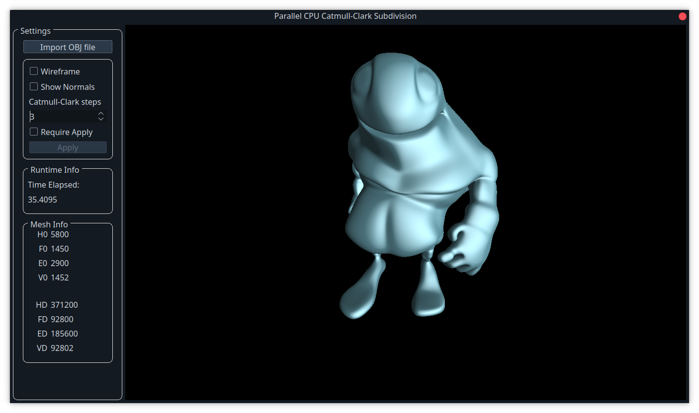
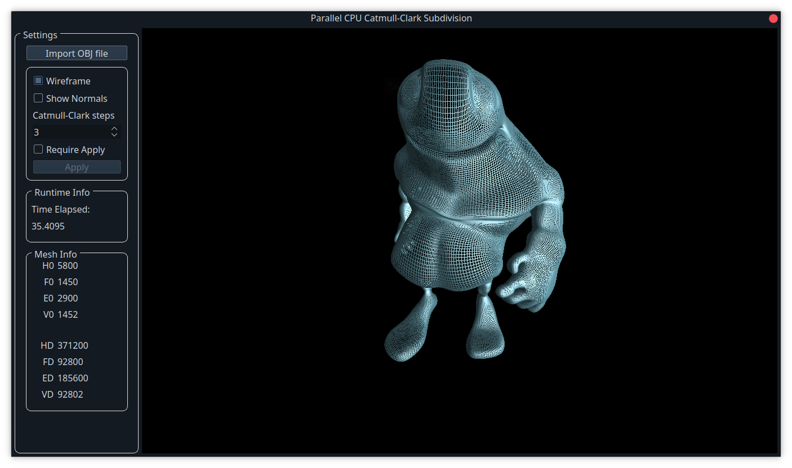
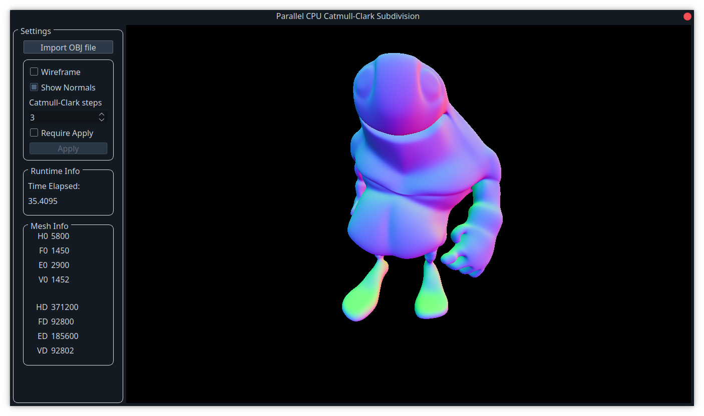

<br />
<p align="center">
  <h1 align="center">Parallel CPU Catmull-Clark Subdivision</h1>

  <p align="center">
    A fast CPU-based Catmull-Clark subdivision framework
  </p>
</p>

## About The Project

This framework contains the parallel CPU implementation of the method described in the paper: [A Halfedge Refinement Rule for Parallel Catmull-Clark Subdivision](https://onlinelibrary.wiley.com/doi/10.1111/cgf.14381?af=R).
The framework supports quad meshes, non-quad meshes and meshes with boundaries.

## Getting Started

To get a local copy up and running follow these simple steps.

### Prerequisites

You need the following to be able to compile and run the project:

* [Make](https://www.gnu.org/software/make/)
* [Qt](https://www.qt.io/)

### Setup

To set up the program, run the following commands:
```sh
git clone git@github.com:BugelNiels/parallel-cpu-catmull-clark-subdivision.git
qmake CpuSubdivision.pro
make
cd build
```

### Running

You can run the project as follows to run the full framework include GUI:

```sh
./cpuSubdivide
```
To run the project without the GUI, you can use the following:
```sh
./cpuSubdivide -c -f "../models/bigguy.obj" -l 6 -t 4
```
This will run the commandline subdivision on `bigguy.obj`. It will subdivide the mesh provided at the `-f` position: `models/bigguy.obj` 6 times (`-l`) using 4 threads (`-t`). For now, the framework does not save any results. The timings in milliseconds will be written to a file called timings.txt.

Alternatively, it can be run using QtCreator by opening the `CpuSubdivision.pro` file and pressing the run button (or pressing ctrl+r).

## Usage

The `Import OBJ file` button can be used to import .obj files. A number of example meshes are provided in the `models` directory.


Movement around the mesh is performed by pressing and dragging the mouse. Scrolling can be used for zooming in and out.

A number of Catmull-Clark subdivision steps can be applied by changing the spinner. Note that it will reevaluate the entire mesh each time this spinner is changed. This is done so that the timings are accurate.

In addition to changing the spinner, the `Require Apply` checkbox can be enabled to apply the subdivision once the user presses `Apply`.



The frameworks also provides options to display the wireframe and normals of the mesh:







Timings and a summary of the base mesh and subdivided mesh can be found on the bottom left.